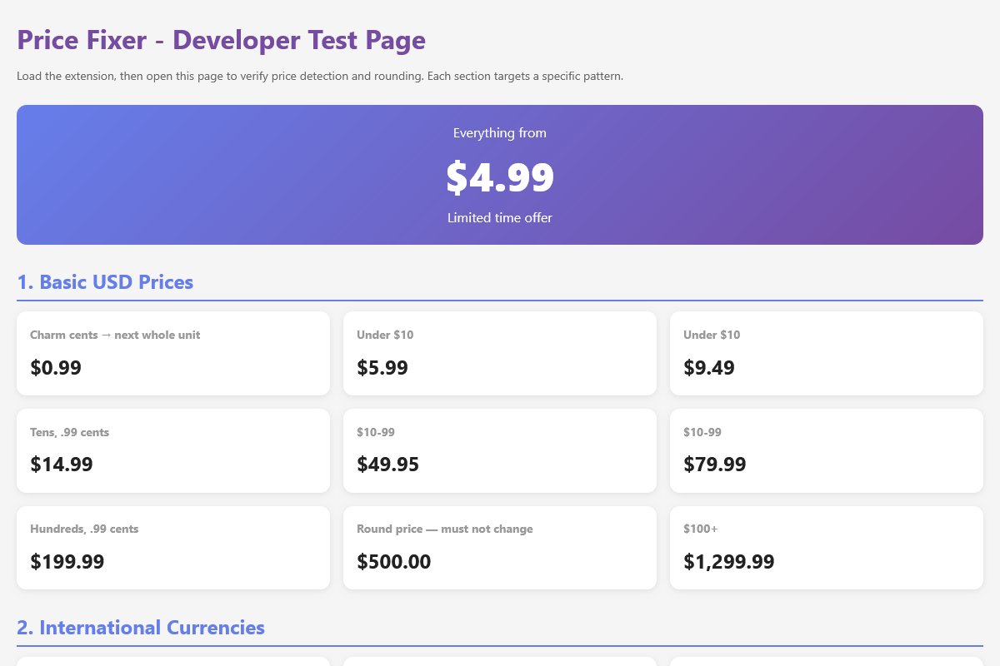
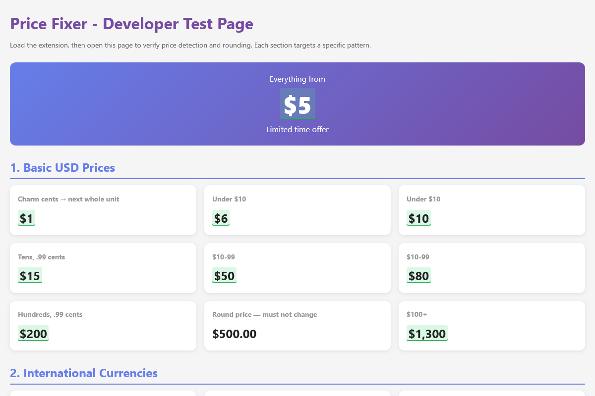
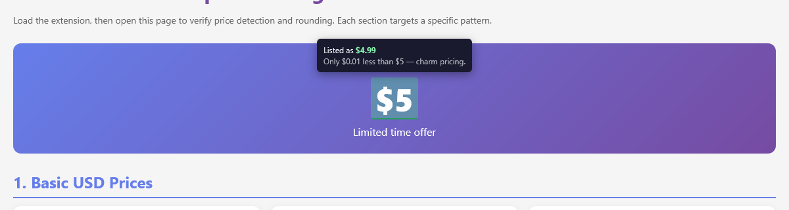
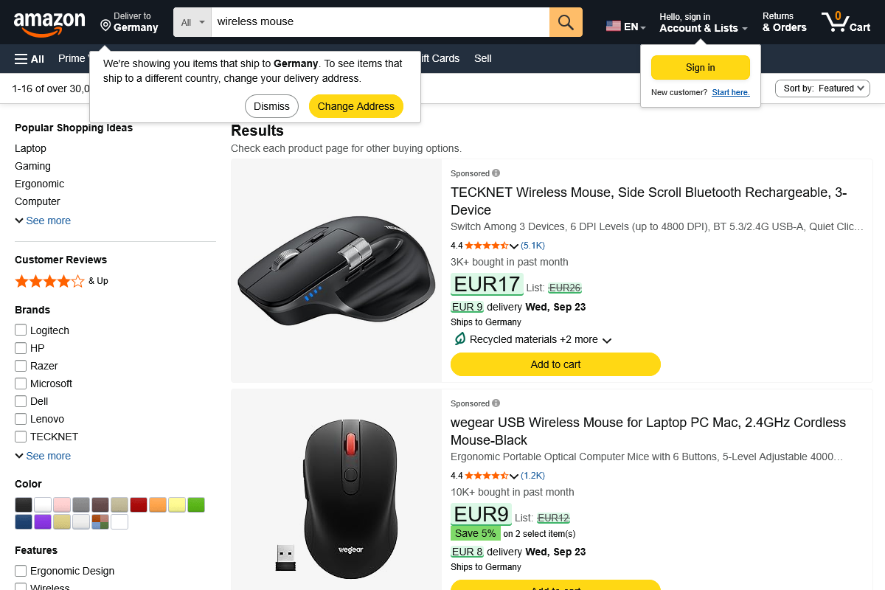
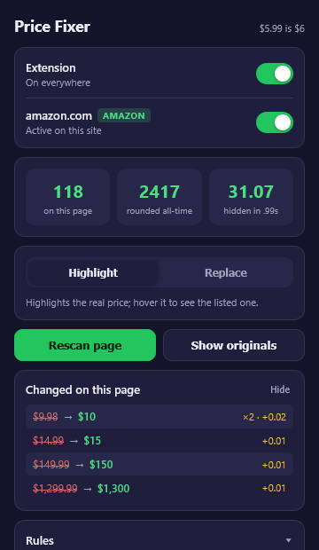
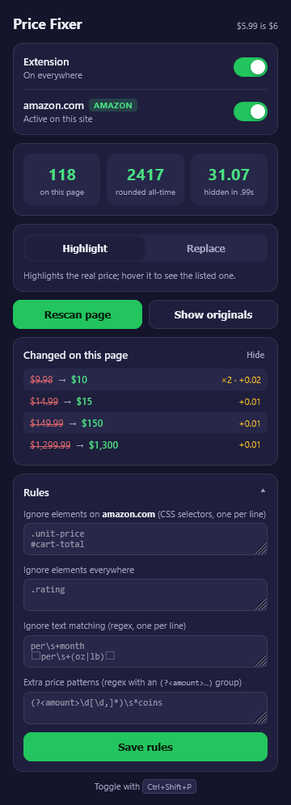
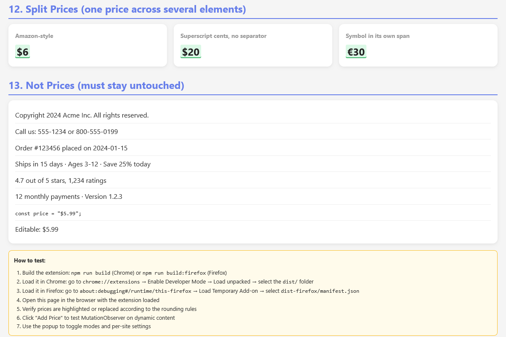

# Price Fixer

**$5.99 is $6.** A Chrome/Firefox extension that finds charm prices on any web
page and shows the number they are pretending not to be.

<p align="center">
  
</p>

| Before                                   | After                                   |
| ---------------------------------------- | --------------------------------------- |
|  |  |

## How it works

- Every price on the page is scanned — plain text, prices split across several
  elements (Amazon's `$` `5` `.` `99`, Walmart's superscript cents, Digikala's
  Toman icon) and content that loads later.
- Only **charm prices** are changed: `.99`/`.95`/`.49` cents, whole amounts
  ending in 9 (`$199`), and the same at thousands scale (`999,000`). Round
  prices such as `$12.00` or `$500` are never touched.
- **Highlight mode** (default) shows the honest price with a green highlight;
  hover it to see the listed price and how little was actually taken off.
  **Replace mode** swaps the text silently.
- Nothing is destroyed: every change is recorded and **Show originals** puts the
  page back exactly as it was. Restoring a site keeps it untouched for the rest
  of the browser session until you rescan.
- The page's own scripts keep working — the price element's text is just the
  honest number; the listed price lives in an attribute.



## Screenshots

| Amazon                         | Walmart                         |
| ------------------------------ | ------------------------------- |
|  |  |

| Digikala (Persian digits, Toman icon) | Apple                         |
| ------------------------------------- | ----------------------------- |
|       |  |

| Popup                         | Custom rules                        |
| ----------------------------- | ----------------------------------- |
|  |  |



## Supported prices

- Symbols before or after the number: `$` `€` `£` `¥` `￥` `₹` `₽` `₩` `₺` `₪`
  `₫` `₴` `₸` `₱` `﷼` and more — `$5.99`, `5,99 €`, `₹499`, `￥99.00`
- ISO codes and words: `299 EUR`, `USD 12.99`, `RMB 5999`, `Rs. 499`, `US$ 5`,
  `99元`, `1.999円`, `49,99 zł`, `1 299 Kč`, `299 kr`, `۱٬۲۹۹٬۰۰۰ تومان`
- Number formats: `1,234.99`, `1.234,99`, `1 299`, Persian/Arabic-Indic digits
  with `٬`/`٫` separators. Output keeps the page's own separators, digit script
  and grouping style.
- Iranian shops that draw the currency as an icon: a bare grouped Persian number
  next to an `<svg>`/`` counts as a price.

Numbers without a currency marker are never touched, so dates, phone numbers,
order IDs, ratings, "ships in 15 days" and "save 25%" stay as they are.

## Rounding

| Listed                           | Shown             | Why                               |
| -------------------------------- | ----------------- | --------------------------------- |
| `$5.99`                          | `$6`              | fractional → next whole unit      |
| `$149.99`                        | `$150`            |                                   |
| `€1.299,99`                      | `€1.300`          | European separators preserved     |
| `$199`                           | `$200`            | whole amount ending in 9          |
| `۱٬۲۹۹٬۰۰۰ تومان`                | `۱٬۳۰۰٬۰۰۰ تومان` | same after dropping `٬۰۰۰` groups |
| `$9`, `$12.00`, `$101`, `¥2,980` | unchanged         | not charm pricing                 |

## Install

### From source

```bash
npm install
npm run build:all      # dist/ (Chrome) and dist-firefox/ (Firefox)
npm run package        # also zips both as price-fixer-*.zip
```

- **Chrome**: `chrome://extensions` → Developer mode → Load unpacked → `dist/`
- **Firefox**: `about:debugging#/runtime/this-firefox` → Load Temporary Add-on →
  `dist-firefox/manifest.json`

Firefox MV3 does not grant site access automatically. If the popup says the
extension is not active on a page, click **Enable on this site**.

## Using it

- Click the toolbar icon: global on/off, per-site on/off, Highlight/Replace,
  **Rescan page**, **Show originals**, and the list of what changed on the page.
- `Ctrl+Shift+P` (`⌘⇧P` on macOS) toggles the extension.
- **Settings** (gear icon in the popup, or the browser's extension options)
  opens a full-page settings tab: the same switches, blocked sites, every
  per-site switch you have set, rules for any site, statistics, and a reset.
- Light and dark themes: follows your system by default; the sun/moon button in
  the popup or the Theme control in settings overrides it.
- **Security** (in the popup):
  - _Pause on payment pages_ (on by default) — checkout pages, card forms and
    payment gateways (PayPal, Stripe, Klarna, Shaparak, …) are never changed, so
    the amount you are about to pay is always shown exactly as the site states
    it.
  - _Blocked sites_ — **Block this site** keeps Price Fixer off the current site
    (and its subdomains) permanently; you can also type any domain to add it,
    and remove entries from the list.
- **Rules** (bottom of the popup) lets you add exceptions, one per line:
  - _Ignore elements on this site_ / _everywhere_ — CSS selectors, e.g.
    `.unit-price`, `#cart-total`
  - _Ignore text matching_ — regexes, e.g. `per\s+month`
  - _Extra price patterns_ — regexes with an `(?<amount>…)` group for formats
    the built-ins don't know, e.g. `(?<amount>\d[\d,]*)\s*coins`

  Rules are stored in sync storage and applied to open tabs immediately; invalid
  entries are listed under the form.

## Development

```bash
npm run dev            # watch build (Chrome)
npm run dev:firefox    # watch build (Firefox)
npm run dev:test       # build + serve the test page at http://localhost:3456
npm test               # Jest (ts-jest + jsdom)
npm run validate       # type-check + lint + format check + tests
```

To try the real extension in Firefox with hot reload:

```bash
node scripts/dev-server.js &
npx web-ext run --source-dir dist-firefox --start-url http://localhost:3456/
```

`test-page.html` covers every supported format plus a "must not change" section;
`src/__tests__/` has 119 unit tests for detection, rounding, formatting, the DOM
engine (highlight/replace/restore/split prices/dynamic content) and custom
rules.

### Project layout

```
src/
├── content.ts           # content-script bootstrap
├── priceFixerContent.ts # page engine: scan, highlight/replace, restore, rules
├── pricePatterns.ts     # detection, charm rules, format-preserving output
├── regex-patterns.ts    # currency patterns (regex library, named groups)
├── customRules.ts       # user rules (selectors / regexes) from storage
├── site-patterns.ts     # price selectors for big shops (scanned first)
├── shopping-sites.ts    # known shop domains (popup badge)
├── background.ts        # keyboard shortcut, inject into open tabs on install
└── __tests__/
popup.html / popup.js    # toolbar popup
options.html / options.js # full-page settings (options_ui, opens in a tab)
ui-common.js / ui.css    # helpers, theme and styles shared by both pages
icons/icon.svg           # source of all icon sizes
scripts/                 # dev server, packaging
test-page.html           # manual test page
```

## Releasing

Bump `version` in `package.json`, `manifest.json` and `manifest.firefox.json`,
then push a tag:

```bash
git tag v1.1.0 && git push origin v1.1.0
```

The release workflow validates, builds both packages, attaches them to a GitHub
release and — when the store credentials are set as repository secrets —
publishes to the Chrome Web Store (`CHROME_EXTENSION_ID`, `CHROME_CLIENT_ID`,
`CHROME_CLIENT_SECRET`, `CHROME_REFRESH_TOKEN`) and Firefox Add-ons
(`AMO_JWT_ISSUER`, `AMO_JWT_SECRET`). Without the secrets the store jobs skip
themselves.

## Roadmap

- Page summary card ("47 prices, 39 use charm pricing")
- "Real total" for carts and comparison pages
- Hidden-fee / drip-pricing hints (`+ tax`, `+ shipping`, `from $X*`)
- Unit prices (`$3.99/lb` → `$4/lb`)
- Currency conversion hints

## License

[MIT](LICENSE)
